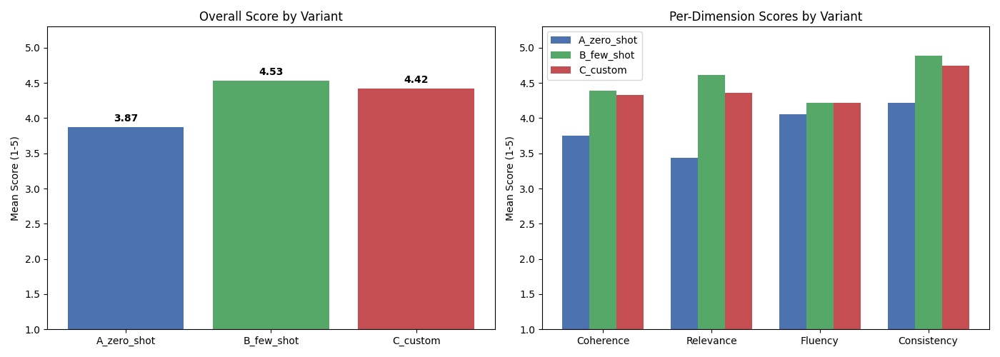
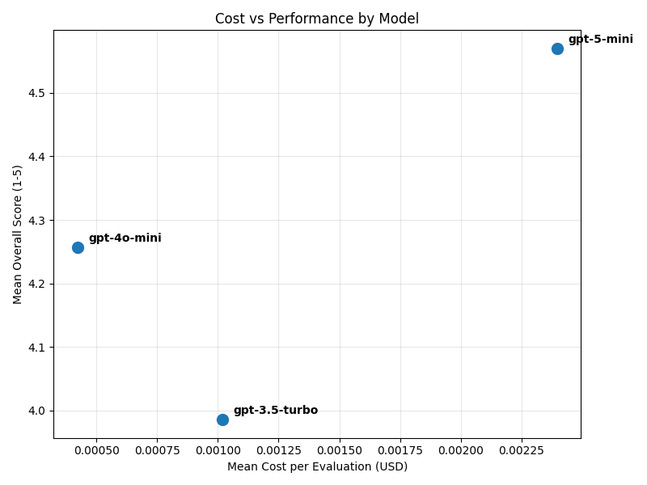
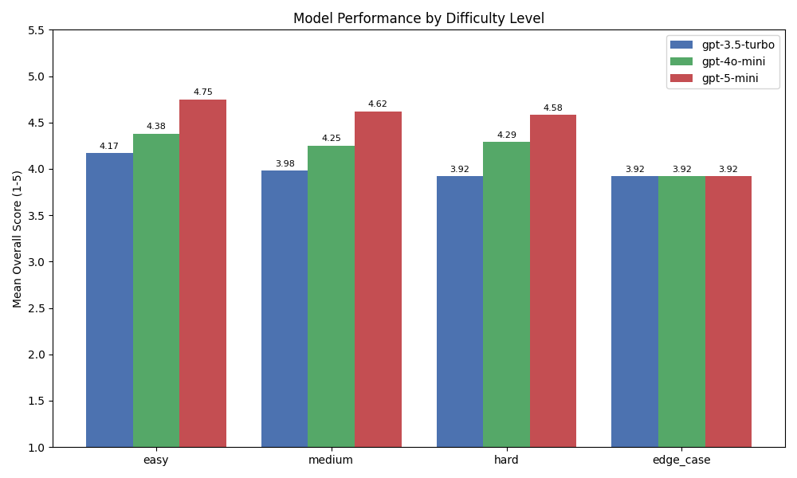

# README

## The Model Evaluation Pipeline

Every team building with LLMs eventually hits the same question, "Which model should we actually use? The expensive one seems better, but is it worth 10x the cost? The cheap one works fine sometimes, but when does it break?"

The best way to go about this is measuring the actual quality difference for their specific use case.

You need data, not opinions.

The solution is simple: build an evaluation pipeline. Run your actual use case through multiple models and prompt strategies. Measure quality systematically. Track real costs. Compare the results. Then decide.



This was an evaluation pipeline built for a career advice chatbot. Three models, three prompt variants, twelve test cases across difficulty levels. That's 108 evaluations. Each one scored by an LLM judge on four dimensions. Each one tracked for actual token costs.

The output that matters most is cost versus performance. Plot mean cost per evaluation against mean quality score. This is where you discover that the cheaper model delivers 90% of the quality at 20% of the cost. Or that the expensive model only barely outperforms on easy questions but pulls ahead on hard ones.





The framework is reusable. Swap the prompts, change the test cases, update the model list. The judge template, cost tracking, and visualization pipeline work unchanged. It doesn't care if you're building a career advisor or a customer service chatbot. It cares about measuring quality and cost systematically.

## Project Structure

### Pipeline Entry Point

- **`main.py`** — Runs the full pipeline with a single command. Executes evaluation, visualization, and difficulty analysis in sequence, passing the output folder automatically between steps.

### Core Evaluation

- **`main_llm_models.py`** — The evaluation engine. Loops over every combination of model, prompt variant, and test case. Sends each question to the chatbot, judges the response with an LLM, tracks token costs, and saves all results to a timestamped CSV.
- **`eval.py`** — Handles the LLM-as-judge pattern. Sends the judge prompt to the judge model, parses the structured output (scores + justifications for Coherence, Relevance, Fluency, Consistency), and returns cost info.
- **`prompts.py`** — Contains the three prompt variants (`A_zero_shot`, `B_few_shot`, `C_custom`), the 12 test cases with difficulty levels and expected key aspects, and the judge prompt template with the 1-5 scoring rubric.

### Configuration

- **`openai_client.py`** — Initializes the OpenAI client using the API key from `.env`.
- **`openai_models.py`** — Defines which models to evaluate (`CHATBOT_MODELS`) and which model serves as the judge (`JUDGE_MODEL`).
- **`costs.py`** — Thin wrapper around the `tokencost` library that converts token counts to USD for any supported model.

### Analysis & Visualization

- **`visualize.py`** — Generates variant comparison bar charts (overall and per-dimension) and a cost-vs-performance scatter plot comparing models.
- **`difficulty_breakdown.py`** — Produces a variant x difficulty heatmap, model x difficulty grouped bar chart, cost efficiency breakdowns, and prints best/worst case analysis with off-topic handling details.

## Usage

Run the full pipeline:

```bash
python main.py
```

Or run each step individually:

```bash
python main_llm_models.py          # Step 1: Run evaluations
python visualize.py                # Step 2: Generate variant/cost plots
python difficulty_breakdown.py     # Step 3: Difficulty analysis & charts
```

All outputs are saved to `output/<timestamp>/` with the CSV and all generated charts.
